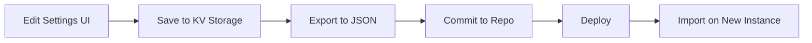

# Environment Variables Sync System Documentation

## Overview
This document explains how to use the Environment Variables Sync System for the TBA-WAAD Health Insurance Platform. The system provides a user-friendly interface to manage and sync application configuration across deployments.

## 🎯 Purpose
The sync system allows administrators to:
- Manage application configuration through a web UI
- Export configuration to `spark.meta.json` for version control
- Import configuration from saved files
- Persist settings across sessions using Spark KV storage

## 🔧 Configuration Structure

The system manages the following environment variables:

```json
{
  "templateVersion": 1,
  "dbType": "kv",
  "variables": {
    "API_URL": "http://localhost:9090",
    "FRONTEND_URL": "http://localhost:3000",
    "DEFAULT_LANGUAGE": "ar",
    "SUPPORTED_LANGUAGES": ["ar", "en"],
    "JWT_SECRET": "your-secret-key"
  },
  "lastSync": "2025-01-08T00:00:00Z"
}
```

## 📋 Variable Descriptions

| Variable | Description | Example |
|----------|-------------|---------|
| `API_URL` | Backend API endpoint | `http://localhost:9090` |
| `FRONTEND_URL` | Frontend application URL | `http://localhost:3000` |
| `DEFAULT_LANGUAGE` | Default UI language | `ar` (Arabic) or `en` (English) |
| `SUPPORTED_LANGUAGES` | List of available languages | `["ar", "en"]` |
| `JWT_SECRET` | Secret key for JWT authentication | `your-secure-secret-key` |

## 🚀 How to Use

### 1. Access Settings
Navigate to **Settings** in the sidebar menu to access the configuration management interface.

### 2. Configure Variables
Edit any of the environment variables in the form fields:
- **API URL**: Change the backend endpoint
- **Frontend URL**: Update the frontend base URL
- **Default Language**: Set the default language (ar/en)
- **Supported Languages**: Add or remove supported languages
- **JWT Secret**: Update the authentication secret

### 3. Save Configuration
Click **"Save Configuration"** to persist changes to Spark KV storage. This ensures your settings survive page refreshes and deployments.

### 4. Export to spark.meta.json
Click **"Export to spark.meta.json"** to download a JSON file with your current configuration. This file can be committed to your repository.

### 5. Sync with Repository

#### Manual Method:
1. Export configuration using the Settings UI
2. Replace `/spark.meta.json` in your repository with the downloaded file
3. Commit with message: `chore(tba-waad-system): sync Spark environment variables`
4. Push to your deployment branch

```bash
# Example commands
mv ~/Downloads/spark.meta.json ./spark.meta.json
git add spark.meta.json
git commit -m "chore(tba-waad-system): sync Spark environment variables"
git push origin main
```

### 6. Import Configuration
To restore or share configuration:
1. Click **"Import from File"**
2. Select a previously exported `spark.meta.json` file
3. Configuration will be loaded and saved automatically

### 7. Reset to Defaults
Click **"Reset to Defaults"** to restore the original configuration values.

## 🔒 Security Considerations

### JWT Secret
- **Never commit actual secrets** to public repositories
- Use placeholder values like `"your-secret-key"` in the repository
- Set real secrets through the UI after deployment
- For production, use environment-specific secrets

### Best Practices
1. Keep production secrets separate from development
2. Use different JWT secrets for each environment
3. Rotate secrets regularly
4. Never share JWT secrets via email or chat

## 🌐 Multi-Language Support

The Settings interface is fully bilingual:
- **English (EN)**: Full interface and instructions
- **Arabic (AR)**: Fully translated with RTL layout support

Switch languages using the language selector in the top navigation bar.

## 📱 Access Control

The Settings module should be restricted to administrators only. Ensure proper role-based access control is configured in your authentication system:

```typescript
// In your auth context
if (user.role !== 'ADMIN') {
  // Redirect or hide Settings option
}
```

## 🔄 Configuration Lifecycle



1. **Edit**: Modify variables in Settings UI
2. **Save**: Persist to Spark KV storage
3. **Export**: Download as spark.meta.json
4. **Commit**: Add to version control
5. **Deploy**: Push to hosting environment
6. **Import**: Load configuration on new instances

## 🛠️ Technical Implementation

### Storage
- Uses Spark KV API (`useKV` hook)
- Key: `app-config`
- Persists across sessions and deployments

### File Format
- Standard JSON format
- Compatible with version control
- Human-readable and editable

### Components
- **Settings.tsx**: Main configuration UI
- **configService.ts**: Configuration management utilities
- **spark.meta.json**: Configuration storage file

## 📝 Example Workflows

### Scenario 1: Changing Backend URL
1. Open Settings
2. Update "API URL" to new backend address
3. Click "Save Configuration"
4. Test the application
5. Export and commit when satisfied

### Scenario 2: Adding a New Language
1. Open Settings
2. Add new language code to "Supported Languages" (e.g., `ar, en, fr`)
3. Save configuration
4. Export to spark.meta.json
5. Commit and deploy
6. Add translation files for the new language

### Scenario 3: Production Deployment
1. Clone repository
2. Import development spark.meta.json
3. Update production-specific values (API URL, JWT Secret)
4. Save but don't commit secrets
5. Deploy application

## 🐛 Troubleshooting

### Configuration Not Persisting
- Ensure you clicked "Save Configuration"
- Check browser console for errors
- Verify Spark KV is available

### Export Not Working
- Check browser download permissions
- Ensure popup blockers are disabled
- Try a different browser

### Import Fails
- Verify JSON file format is correct
- Check file contains `variables` key
- Ensure file is valid JSON

## 📚 Related Documentation
- [Backend Integration Guide](./BACKEND_INTEGRATION.md)
- [i18n Documentation](./I18N_DOCUMENTATION.md)
- [Security Guide](./SECURITY.md)

## ✅ Checklist

Before deploying, ensure:
- [ ] All URLs point to correct environments
- [ ] JWT secret is set and secure
- [ ] Default language matches target audience
- [ ] Configuration is saved in KV storage
- [ ] spark.meta.json is committed to repository
- [ ] Secrets are not exposed in version control

---

**Last Updated**: 2025-01-08  
**Version**: 1.0.0  
**Maintainer**: TBA-WAAD Development Team
